# HPLC-GC-Performance-Data-Analytics-for-QC-Intelligence
This repository showcases an end-to-end data analytics project that analyzes HPLC and GC quality control (QC) data using 
Excel, SQL, Python, Tableau, and Power BI. It demonstrates data cleaning, relational database modeling, statistical QC, 
anomaly detection, time-series analysis, culminating in interactive dashboards for monitoring calibration performance and instrument health.

#### Author: Christopher Edozie Sunday  
#### Tech Stack: Excel | SQL (SQLite)| Python| Jupyter Notebook| Tableau| Power BI  
#### Project Type: Analytical Chemistry / Data Analytics  
#### Stakeholders: QC Managers, Lab Supervisors, and Data Analysis Teams  
#### Keywords: Data Analytics, SQL, Python, Tableau, Dashboards, Power BI, Data Modeling, Statistical Analysis, Time-series Analysis, Anomaly Detection, KPIs 
#### Status: This project is under active development. Report structure, notebooks, and visualizations will be incrementally refined to reflect real-world regulated laboratory analytics.

### Project Overview
This project demonstrates an end-to-end data analytics workflow that transforms laboratory-generated HPLC and GC performance data into actionable quality intelligence, enabling early detection of instrument drift, calibration instability, and process anomalies before they compromise results. It bridges the gap between raw chromatographic outputs and decision-ready insights, allowing scientists, quality professionals, and supervisors to proactively monitor instrument performance, method stability, and analytical reliability.

This project is designed to reflect real-world laboratory operations in pharmaceutical quality control, mining assay laboratories, and academic research facilities, where data integrity, reproducibility, and timely interpretation of results are critical.

### Scientific & Quality Context
Chromatographic data is foundational to analytical decision-making, yet it is often siloed within instrument software, inconsistently structured, and underutilized for trend-based quality monitoring. Across regulated and non-regulated environments, laboratories face common challenges:

- Instrument drift and performance variability
- Delayed detection of analytical anomalies
- Fragmented data across instruments and runs
- Limited visibility into long-term trends

In pharmaceutical and mining laboratories, these issues directly impact compliance, throughput, and risk management. In academic settings, they affect data reliability, reproducibility, and research validity. This project addresses these challenges through structured data modeling and statistical analysis.

### Objectives
- Convert raw HPLC/GC data into structured, analysis-ready datasets
- Design a 3NF relational schema suitable for chromatographic quality control data
- Implement foreign keys & indexing, and demonstrate SQL joins
- Monitor instrument and method performance over time
- Detect anomalies, drift, and emerging quality risks early
- Support preventive maintenance and method optimization
- Demonstrate audit-ready, reproducible analytics workflows in JupyterLab (DDL + queries)
- Build interactive Tableau dashboards for quality control review
- Bridge analytical chemistry and data analytics

### Data Description
The project uses a simulated chromatographic QC dataset designed to closely reflect real HPLC/GC laboratory outputs while avoiding proprietary or confidential data exposure.
Key variables include:

    | Variables         | Purpose                                             |
    |-------------------|-----------------------------------------------------|
    | Sample_ID         | Unique identifier for each QC injection             |
    | Instrument_ID     | Differentiates HPLC vs GC systems                   |
    | RetentionTime_min	| Indicates chromatographic stability                 |
    | Peak_Area         | Primary quantitative detector response              |
    | PeakWidth_min     | Reflects column efficiency and system dispersion    |
    | Concentration_mgL	| Calculated analyte concentration                    |
    | TrueValue_mgL     | Reference value for accuracy assessment             |
    | Run_Date          | Enables time-based trend analysis                   |

Each variable supports downstream QC evaluations such as precision (%RSD), accuracy (%recovery), and system suitability trending.

### Tools & Technologies
    | Tools        | Purpose                                                                           |
    | ------------ | --------------------------------------------------------------------------------- |
    | Excel        | Data simulation, initial data profiling, formatting, and sanity checks            |
    | SQL + SQLite | Relational database design, normalization, traceability, querying                 |
    | Python       | Statistical quality control, anomaly detection, trend analysis, pre-visualization |
    | Tableau      | Interactive dashboards for performance monitoring                                 |

### Workflow Architecture
- Data ingestion and cleaning
- Relational database modeling
- Statistical quality control analysis
- Trend and anomaly detection
- Interactive dashboard reporting

### Project Folder Structure                

    Chromatographic-Data-Analytics/
    │
    ├── excel_files/
    │   ├── hplc_gc_qc_data_raw.xlsx
    │   └── hplc_gc_qc_data_cleaned.xlsx
    │
    ├── database/
    │   ├── qc_structured.db
    │   └── hplc_gc_qc_data.csv
    │
    ├── scripts/
    │   ├── schema_creation.sql
    │   └── data_seeding.sql
    │
    ├── ER_Diagram.png
    │
    ├── reports/
    │   ├── 01_HPLC_GC_performance_analysis_report.ipynb  #Project overview, business context, lifecycle narrative
    │   └── 01_HPLC_GC_performance_analysis_report.html
    │
    ├── notebooks/
    │   ├── 02_data_simulation.ipynb
    │   ├── 03_SQL_database_relational_schema_creation.ipynb
    │   ├── 04_data_import_metrics_computation.ipynb
    │   ├── 05_data_collection_and_profiling.ipynb
    │   ├── 06_calibration_trend_analytics.ipynb
    │   ├── 07_qc_anomaly_analytics.ipynb
    │   ├── 08_system_suitabilty_analytics.ipynb
    │   └── 09_integrated_QC_tableau_export.ipynb
    │
    ├── derived_metrics_outputs/
    │   ├── sample_metrics.csv
    │   ├── system_suitability.csv
    │   ├── calibrations.csv
    │   ├── control_summary.csv
    │   └── master_dataset.csv
    │
    ├── visuals/
    │   ├── calibration_trend_analysis_charts.png
    │   ├── qc_anomaly_detection_analysis_charts.png
    │   ├── method_performance_analysis_charts.png
    │   └── system_suitabilty_analysis_charts.png
    │
    ├── tableau/
    │   └── dashboard_screenshots
    │
    ├── power_bi/
    │   └── dashboard_screenshots
    │
    └── README.md

### SQL Data Modeling & Normalization
A fully normalized SQLite schema (3NF) was designed to emulate real laboratory data infrastructure.

**Core Tables:**
- instruments
- samples
- sample_metrics
- calibrations
- system_suitability
- control_summary

### Statistical & QC Analytics
Python-Driven QC Analytics was performed using Pandas, NumPy, and Scikit-Learn, the project computes the following:

**(a) Sample-Level Metrics**
- Error (mg/L, %)
- Percent recovery
- Response factor
- Z-score outlier detection
- %RSD (precision)

**(b) Calibration Analytics**
- Slope, intercept, R²
- Response factor stability
- Linearity assessment

**(c) Statistical Process Control**
- Shewhart limits
- EWMA charts
- CUSUM charts
- Rolling mean, std, CV

**(d) System Suitability**
- Plate count
- Resolution
- Tailing factor

### Key Analysis Categories
- Calibration Trend and Stability Analysis
- Method Performance and Data Quality Analysis (Accuracy & Precision)
- Quality Control and Anomaly Detection Analysis
- Instrument and System Suitability Analysis

### Key Analysis Methods
- Control charts for precision and stability
- Rolling statistics to assess short- and long-term variability
- Time-series trend analysis to identify drift
- Outlier and anomaly detection to flag atypical runs

### Key Visualizations in Python
#### (1) Quality Control and Anomaly Detection Analysis  

**Peak Area Trend**  
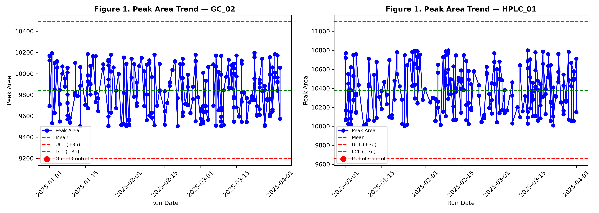  
Insight: Peak area shows consistent behavior across runs; monitor deviations for QC anomalies.

**EWMA Chart**  
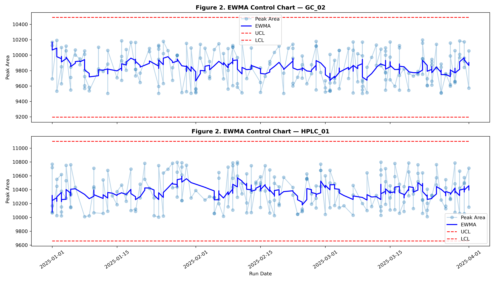  
Insight: Explain what this EWMA chart shows about method performance.
  
**CUSUM Chart**  
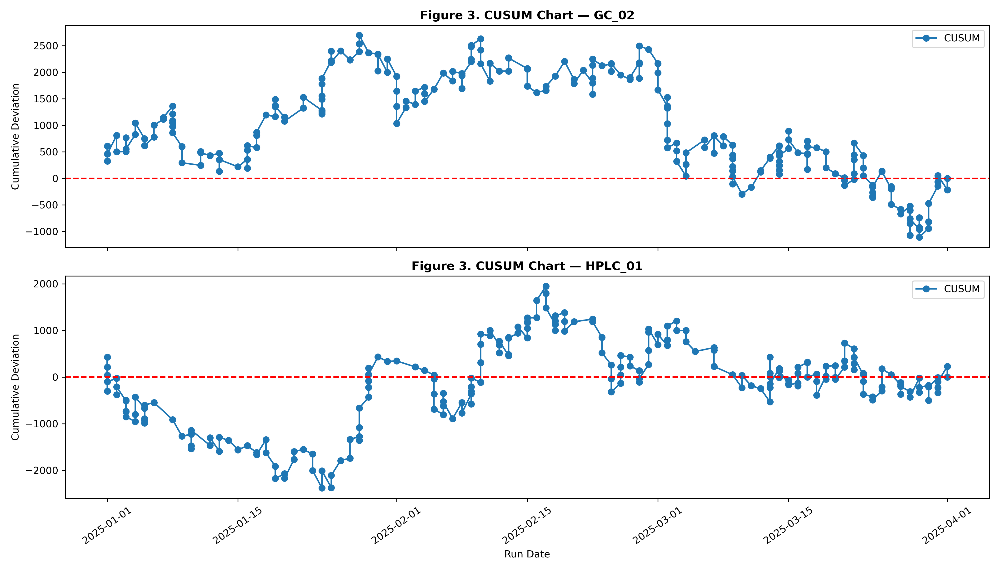  
Insight: Note any trends or deviations.

**Rolling Statistics**  
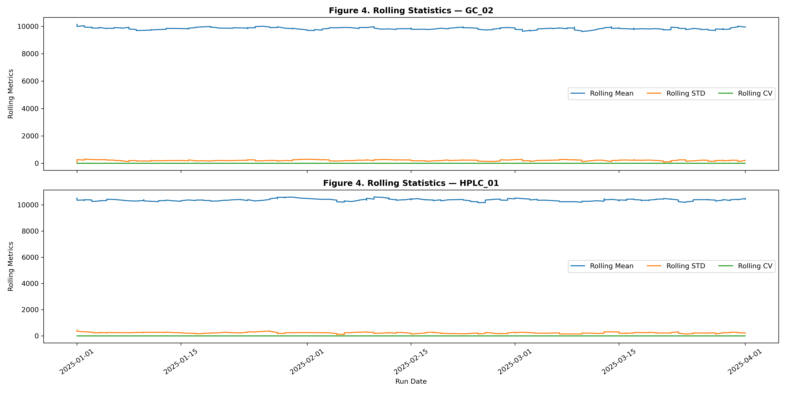  
Insight: Comment on variability across samples.

#### (2) Calibration Trend and Stability Analysis

**Parity Plot**  
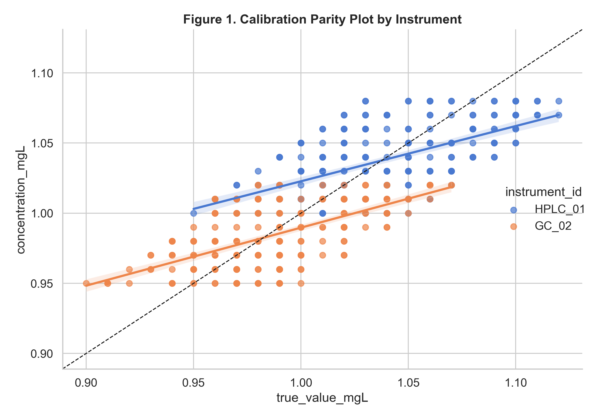  
Insight: Compare predicted vs actual concentrations.

**Accuracy Heatmap**  
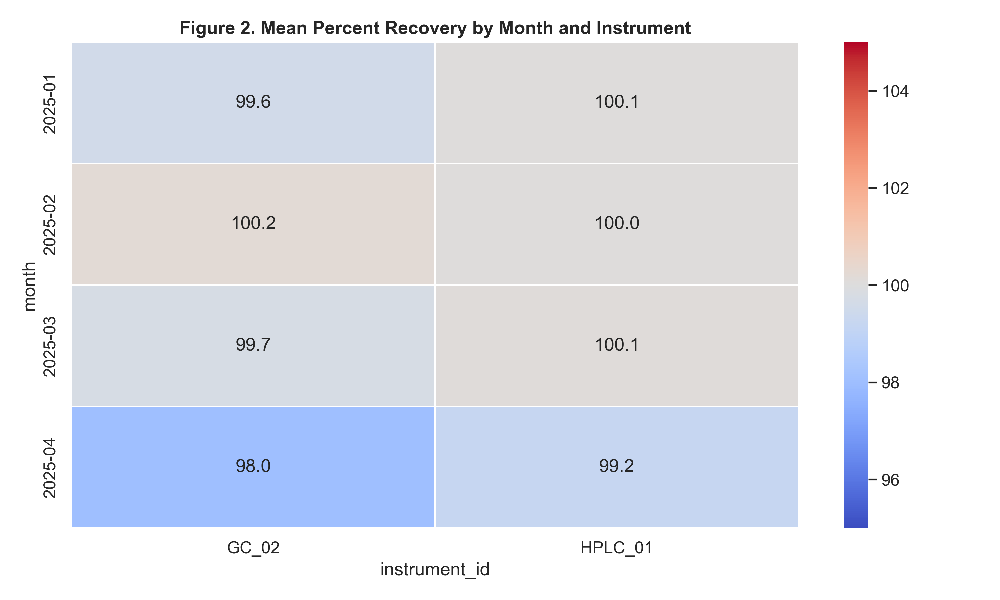  
Insight: Highlight accuracy performance across instruments.

**Response Factor Stability**  
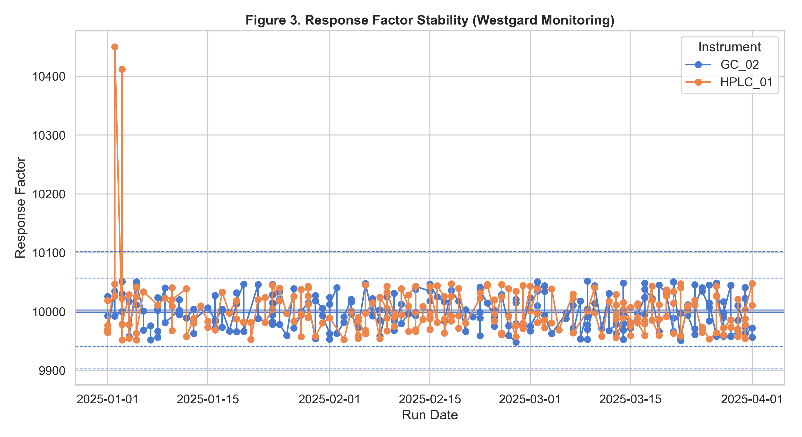  
Insight: Check instrument consistency.

**Calibration Linearity (R²)**  
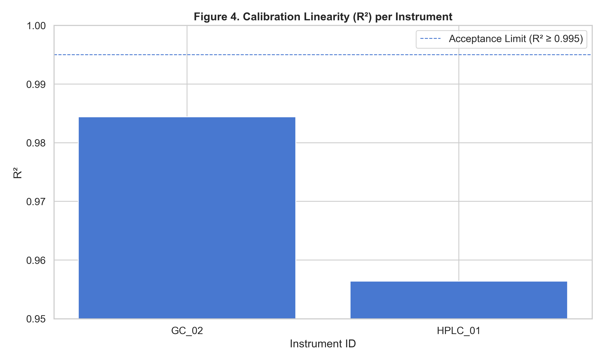  
Insight: Ensure linear response for quantification.

#### (3) Method Performance and Data Quality Analysis (Accuracy & Precision)

**Precision (RSD Distribution)**  
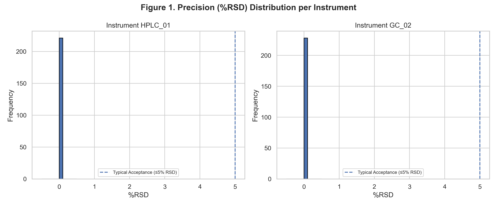  
Insight: Evaluate repeatability of measurements.

**Accuracy Recovery**  
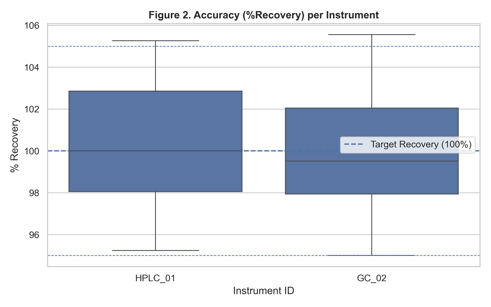  
Insight: Recovery percentages indicate method correctness.

**Instrument Comparison**  
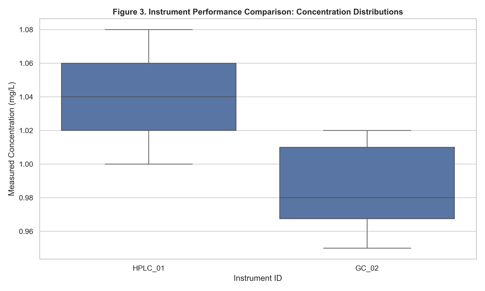  
Insight: Compare performance metrics across instruments.

#### (4) Instrument and System Suitability Analysis

**Resolution Trend**  
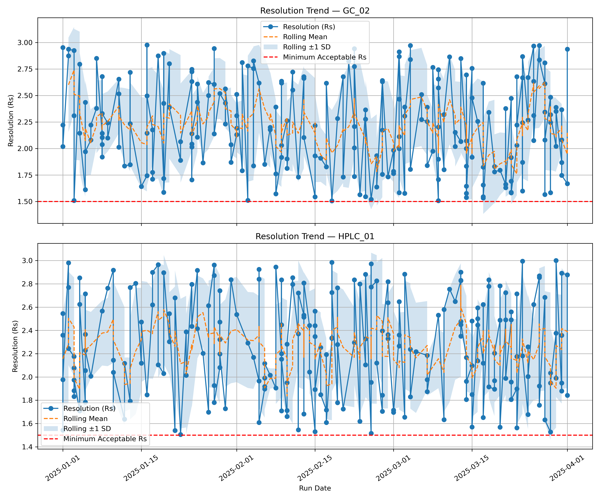  
Insight: Track chromatographic resolution over time.

**Cpk Analysis**  
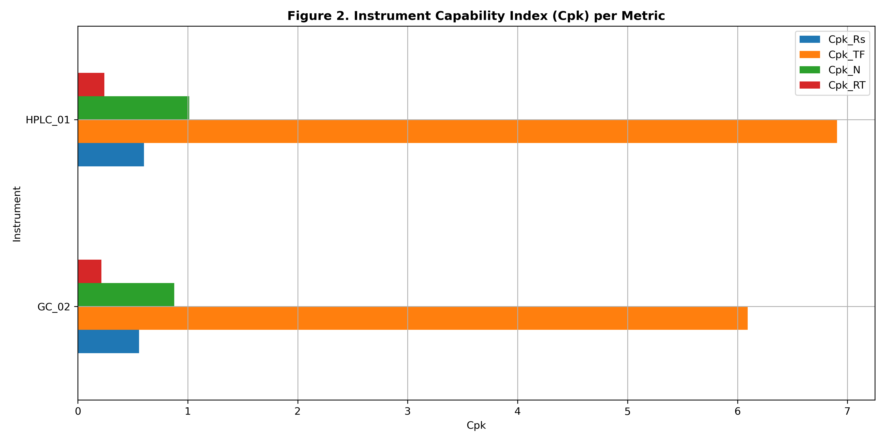  
Insight: Monitor process capability.

**Plate Change Impact**  
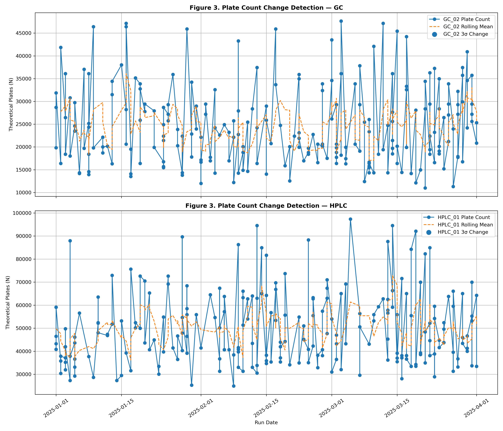  
Insight: Evaluate effect of column/plate changes.

**System Suitability Heatmap**  
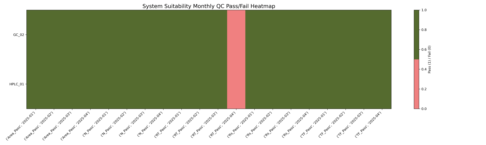  
Insight: Quick overview of system suitability across runs.

**Tailing Factor Trend**  
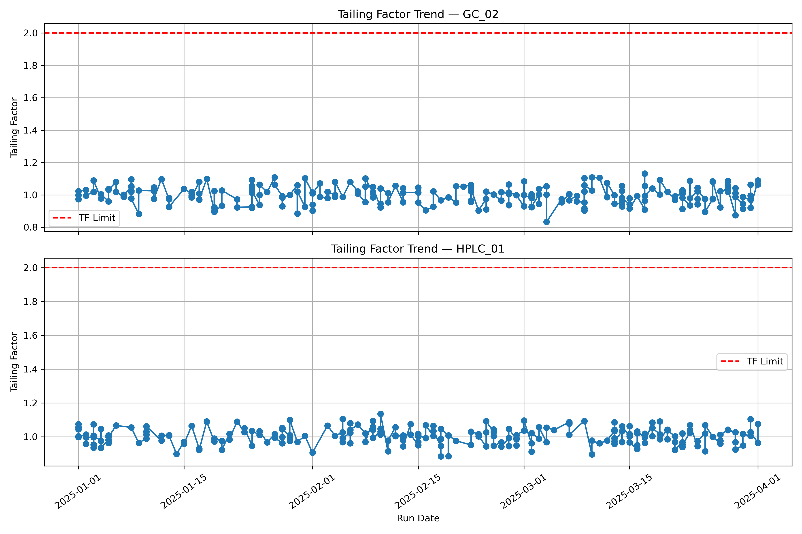  
Insight: Check peak symmetry for method performance.

### Key Findings and Insights
- Calibration models remain linear but show early response factor drift
- EWMA and CUSUM detect subtle instability before control limit breaches
- Precision varies slightly by instrument, highlighting maintenance sensitivity
- System suitability trends flag potential column or injector degradation

### Actionable Recommendations
- Adopt EWMA & CUSUM for routine QC review
- Monitor response factor trends, not just R²
- Standardize QC dashboards for monthly review
- Use rolling CV as an early warning KPI
- Centralize QC computations in Python for auditability

### Expected Impact
Rather than static reports, this project focuses on generating decision-enabling insights that produces the following impacts:

- Early detection of instrument drift before failures occur
- Reduced risk of invalid results
- Improved regulatory defensibility
- Comparison of performance across instruments or methods
- Identification of unstable analytical conditions
- Improved confidence in reported analytical results
- Faster QC decision-making
- Demonstrates scalable analytics maturity

### Regulatory and Quality Considerations
This project emphasizes:
- Data traceability and transparency
- Reproducible analytics workflows
- Audit-ready data structures
- Alignment with QC and QA principles  

(These considerations are critical for pharmaceutical compliance, ISO-aligned mining labs, and peer-reviewed academic research)

### Project Status & Roadmap
**Current:**
- End-to-end analytics pipeline implemented
- Core QC and trend analyses completed

**Next Step:**
- Automated SPC alerts
- Expanded instrument-level comparisons
- Potential integration concepts with LIMS-like systems

### How to Run this Analysis or View the Full Report
#### 1. Prerequisite:
Ensure the following tools and libraries are installed:  
**Software**
- Python 3.9+
- Jupyter Notebook or JupyterLab
- SQLite (or compatible SQL engine)

**Python Libraries**  
pip install pandas numpy matplotlib seaborn sqlalchemy jupyter

#### 2. Run the Analysis Notebooks
- Clone this repository to your local machine.
- Set up the Python environment by launching Jupyter Notebook or JupyterLab from the project root directory.
- Open and execute the notebooks in sequential order (top-to-bottom) to reproduce the full analysis, including:
    - Simulated HPLC/GC QC data generation
    - Data cleaning and validation
    - SQL-based querying and aggregation
    - Statistical QC metrics computation (precision, bias, CV, control trends)
    - Exploratory data analysis and pre-visualizations in python
    - Quality intelligence insights for regulated laboratory environments
- Explore dashboards for interactive insights  

(Detailed instructions are provided in the Jupyter notebooks)

#### 3. View the Full Report
Open the following link in any browser to view a consolidated analytical report (narrative and QC insights) as a static HTML page:  
https://cedozie.github.io/HPLC-GC-Performance-Data-Analytics-for-Quality-Intelligence/

#### 4. View Interactive Dashboards (Tableau / Power BI)
In addition to the notebook-based analysis and static report, this project includes interactive quality intelligence dashboards designed for laboratory managers, QA/QC teams, and scientific leadership.

**Tableau**
- Open the Tableau workbook located in the tableau/ directory (when available).
- Connect to the processed analytical dataset exported from the Python notebooks (.csv).
- The dashboard enables interactive exploration of:
    - Instrument performance trends (HPLC / GC)
    - Retention time stability
    - Precision, bias, and %CV monitoring
    - Out-of-specification (OOS) and drift indicators
    - Cross-instrument and temporal comparisons  

Open the following link in any browser to view a published Tableau Public version:  
https://public.tableau.com/views/CalibrationInstrumentPerformanceAnalyticsQCDriftDetection/CalibrationIntelligence

**Power BI**
- Open the Power BI report file (.pbix) located in the powerbi/ directory (when available).
- Refresh the data connection to load the processed QC dataset generated by the analysis pipeline.
- The report provides:
    - KPI-driven quality monitoring views
    - Drill-down analysis by instrument, analyte, and run date
    - Visual QC thresholds aligned with regulated laboratory expectations
    - Management-ready summaries for quality review meetings  

Open the following link in any browser to view a published Power BI version:

### Final Takeaway
This project demonstrates how laboratory QC data can evolve from static records into proactive quality intelligence using accessible analytics tools. It bridges analytical chemistry and data analytics, showcasing a skill set directly relevant to modern, data-driven scientific and industrial environments.

### Skills Demonstrated
**Analytical Chemistry & Instrumentation**
- Understanding of HPLC and GC system performance parameters
- Interpretation of chromatographic quality metrics (retention time stability, precision, bias, %CV)
- Translation of raw instrument outputs into quality-relevant indicators

**Laboratory Quality Control & Quality Intelligence**
- QC trend analysis and performance monitoring in regulated laboratory environments
- Identification of drift, variability, and out-of-specification (OOS) risk signals
- Data-driven support for continuous improvement and compliance-focused decision-making

**Data Analytics & Statistical Analysis**
- Data cleaning, validation, and transformation of laboratory-generated datasets
- Descriptive and exploratory statistical analysis of analytical performance data
- Application of rolling statistics and temporal trend analysis for QC monitoring

**Python, SQL & Excel**
- Excel-based data simulation using various codes and formulas
- Python-based data analysis using pandas, NumPy, and matplotlib
- SQL querying and aggregation using SQLite for structured QC data storage
- Integration of Python and SQL workflows for reproducible laboratory analytics

**Data Visualization & Dashboarding**
- Creation of clear, interpretable scientific visualizations in Python for QC assessment
- Development of interactive dashboards in Tableau for exploratory quality monitoring
- Development of KPI-driven reports in Power BI for management and QA review

**End-to-End Analytics Workflow Design**
- Design of a modular analytics pipeline from simulated raw QC data to actionable insights
- Export of analysis-ready datasets for downstream BI tools
- Alignment of analytical outputs with stakeholder needs (analysts, QA, lab managers)

**Reproducibility & Documentation**
- Narrative-driven Jupyter Notebooks explaining analytical intent, not just code
- Clear project structure suitable for audit, peer review, and knowledge transfer
- GitHub-based version control and documentation following professional data science standards

**Cross-Domain Communication**
- Bridging analytical chemistry, data analytics, and business intelligence
- Communication of technical QC findings to non-technical stakeholders
- Translation of laboratory data into strategic quality insights

### License
This project is licensed under the MIT License.

### Author Details
- #### Christopher Edozie Sunday, Ph.D. 
- Analytical scientist with expertise in chromatography, quality control, data analytics, and laboratory informatics. Experienced in translating complex analytical data into actionable insights across regulated and research environments. 
- LinkedIn Profile: https://www.linkedin.com/in/c-sunday/
- GitHub Portfolio: https://github.com/cedozie
- Email: c.edozie.sunday@gmail.com

